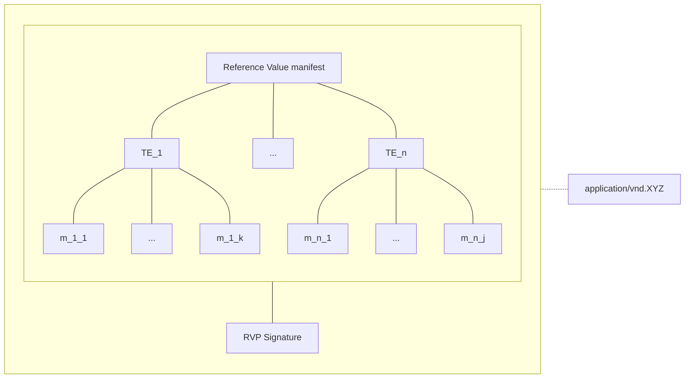
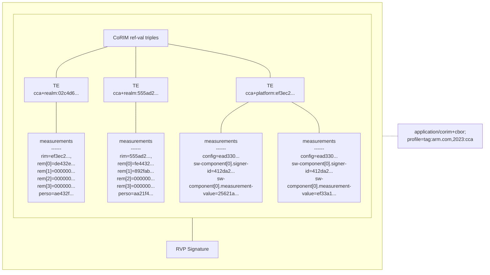
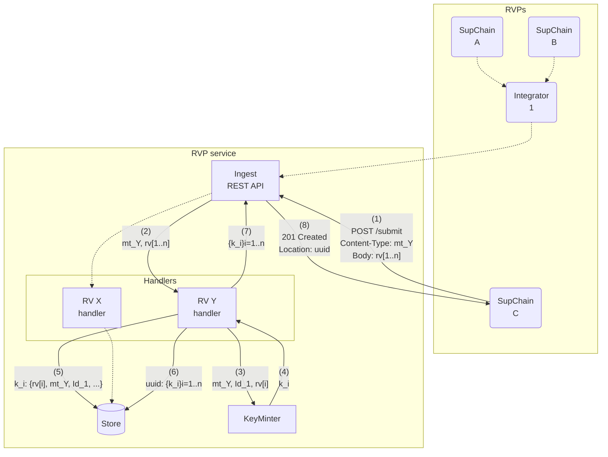
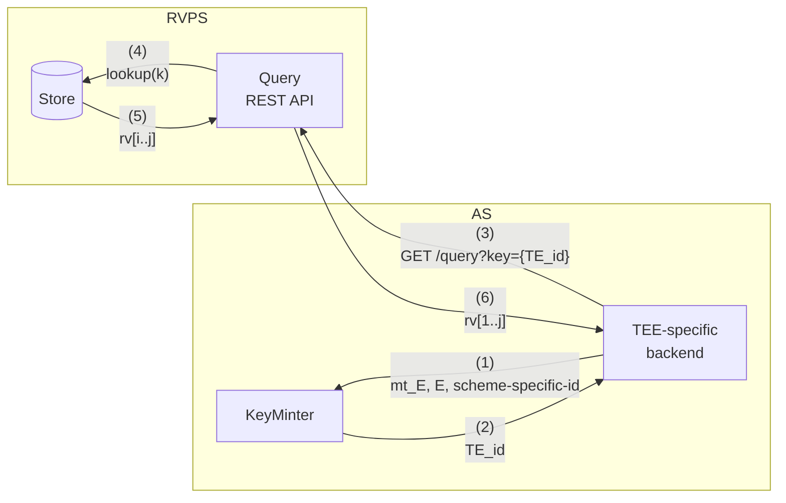
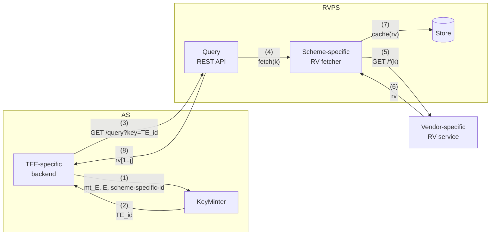

# Proposal

This is a proposal for evolving the Reference Value Provider Service (RVPS) to overcome some of the current shortcomings identified in https://github.com/confidential-containers/kbs/issues/238.

## Design assumptions

### Reference Values "shape"

* Reference values can be provided in "manifests" comprising one or more reference value.
* A reference value applies to a given "target environment" (TE) - see [§3.1 of RATS](https://www.rfc-editor.org/rfc/rfc9334.html#section-3.1).
* Each reference value comprises one or more "measurements" (e.g., digests associated with TCB's SW components, snapshots of certain configuration registers, etc.).
* Each TE has an associated name, for example, an instance or class identifier.  Sometimes, a TE can have an _ephemeral_ name, which may require some amount of creativity to work around - for example, Arm CCA Realms.
* Reference values manifests can be given a [media type](https://www.rfc-editor.org/rfc/rfc6838.html).
* Reference value manifests are signed by a reference value provider (RVP).

Pictorially:



### Examples

The following is an instance of the data model for Arm CCA platform and realm reference values carried in a CoRIM manifest:




### Roles, trust relations, interactions

* An RVP is a supply chain entity.  It could be a TEE vendor, a trusted firmware vendor, a confidential workload developer, or an integrator who takes sole responsibility over a complex supply chain by aggregating and re-signing reference values from trusted, downstream RVPs.
* A trust relationship exists between the RVP and the verifier (owner). Therefore, the identity of the RVP must be known and trusted by the verifier.
* A given RVP is trusted to speak in a trustworthy way about one or more  TEE(s) / confidential workload(s).  The capabilities of an RVP must be known to the verifier.
* Reference values from an unknown RVP MUST be rejected.  (The event MUST be logged.)
* Reference values about a TEE that the RVP is not authorized to "talk about" MUST be rejected.  (This event MUST be logged.)

* The RVPS sits within the same trust perimeter as the verifier, i.e., the verifier implementation trusts the RVPS implementation and vice-versa.  How this trust relationship is established and maintained is out of the scope of the current discussion.


## Architecture

### Ingest (push model)

The following describes the implementation of a "push model" ingestion of reference values.



A unique identifier (UUID) is associated with a given (successful) submission, grouping all the reference values that have been ingested.  This UUID is returned to the RVP.

### Store keys

A key `k_i` identifies a given TE.

A key is deterministically synthesised for each reference value.

Note that different reference values can be associated with the same `k_i`, for example if multiple states are acceptable for a given TE (TEE or workload).

To avoid potential identifier collisions, keys are structured so to provide segregation among different attestation schemes.

They are strings with the following structure (the resemblance with [URNs](https://www.rfc-editor.org/rfc/rfc8141.html) is not accidental):
```
"rvps" ':' <attestation-scheme-id> ':' <scheme-specific-id>
```

`:` is a reserved character and MUST not be present in any of the id blocks.

Attestation schemes will need to provide their `attestation-scheme-id` name and `scheme-specific-id` format.

For this to work, the verifier and RVPS need to have a shared understanding of the syntax and semantics of the keys (i.e., the `KeyMinter` boxes in the diagrams must be aligned).

#### Examples

For CCA realm reference values the base-16 representation of the RIM value is used as `scheme-specific-id`:
```
rvps:cca+realm:02c4d6a3e8472211a45e3cc8119c4aa6a4adcfbe5271381151e917cbd4239da1
```

(As [previously](#reference-values-shape) mentioned, this is an _ephemeral_ name.)

For CCA platform reference values, the base-16 representation of the Implementation ID is used as `scheme-specific-id`:
```
rvps:cca+platform:ef3ec22395bfb57301c8363e765c90dd4898896c19acd8684b9ceedcf58fa411
```

### Query (push model)

The following describes the query interface to the RVPS for reference values that have been ingested into the system by the RVP, as [previously](#ingest-push-model) described.



### Query (pull model)

The following describes the query interface to the RVPS for reference values that need to be fetched from a remote RVP service.

To make apparent the remote interaction, the following assumes a cache miss on the Store for the specific key:



## Known "Bad" Values

There should be a way to model revocation of previously provisioned reference values or, more generally, to define "deny lists" of explicitly prohibited measurements for a given environment.

The syntax of such a construct would be the same as the one used to define RVs with an additional "reason" (e.g., "obsolete", "insecure", etc.).

## Endorsed Values

It should be possible to attach metadata about an environment that can then be added as "augmented claims" to an attestation result if a certain RV (or also if a known bad value), is matched.  E.g., workload name, version, author, link into a supply-chain transparency log, CVE, etc.


